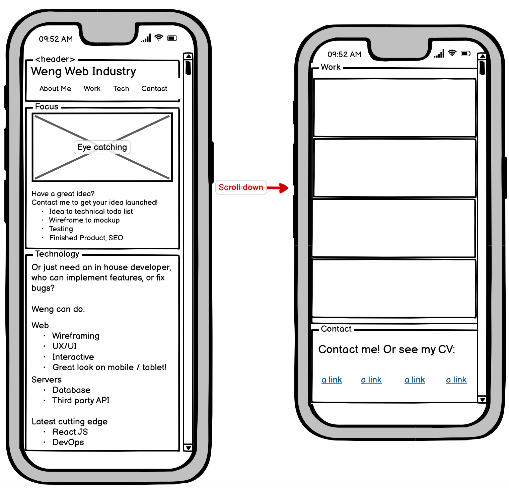

Weng Is Your Web Developer!
===
Do you want to implement your idea into a reality on the world wide web? 

Or do you need an in house developer that can understand your business' vision, implement features, and fix bugs? 

I am a full stack developer that can go from frontend to backend and database with MERN.

I am also well versed with more legacy tools such as PHP and jQuery. This is my portfolio. 

More about me
---

If you are not convinced, contact me at weffung@ucdavis.edu or 323-842-7514 and let's have a chat.

  

View Portfolio
---
[Check out my portfolio](//siphon880gh.github.io/).

Status
---
- Available for hire full time. I am living in Los Angeles, California.
- Although I have many years of experience through small jobs, I want to enter full time programming and am doing the UCLA coding bootcamp to gain more credentials.
- This portfolio is being re-designed. This is a work in progress version 2.

Wireframing for version 1
---
I am agile and can adapt different roles. See my attempt at wireframing.

### Desktop

### Mobile
