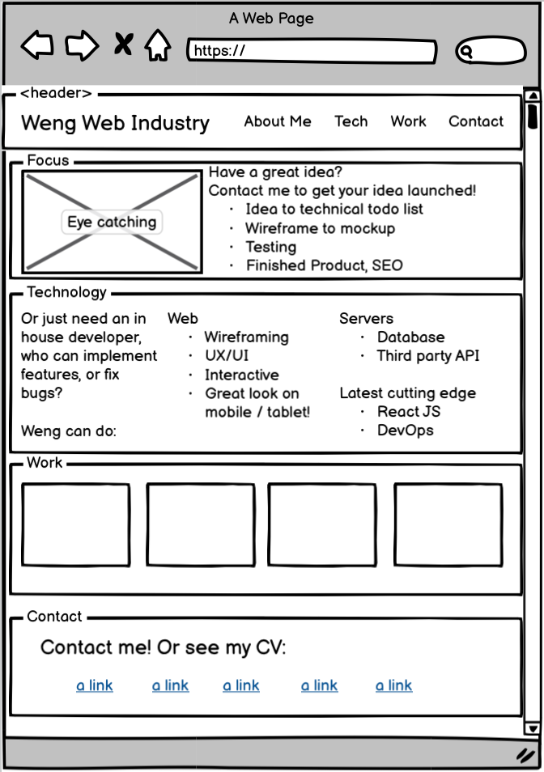
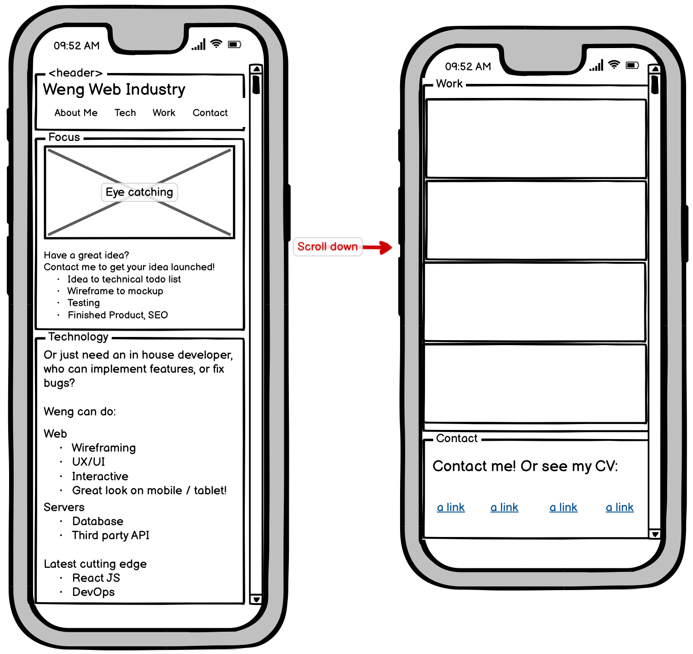

Old Versions
===

Version 2 Screenshot
---
Recreated with React to render sections dynamically using React Router. However, this version does not have webpack bundling the components as ES modules yet.

Version 1 Screenshot
---
One page with links that jump to different sections

Version 1 Wireframes
---
I am agile and can adapt different roles. Here I did a wireframe on how the website layout might look like.

### Desktop

### Mobile

